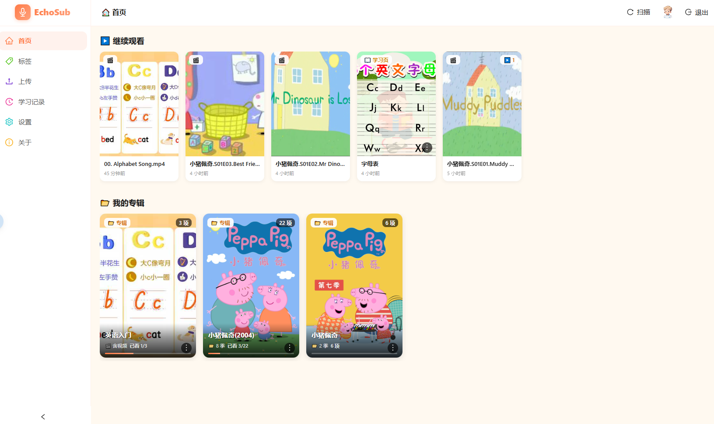
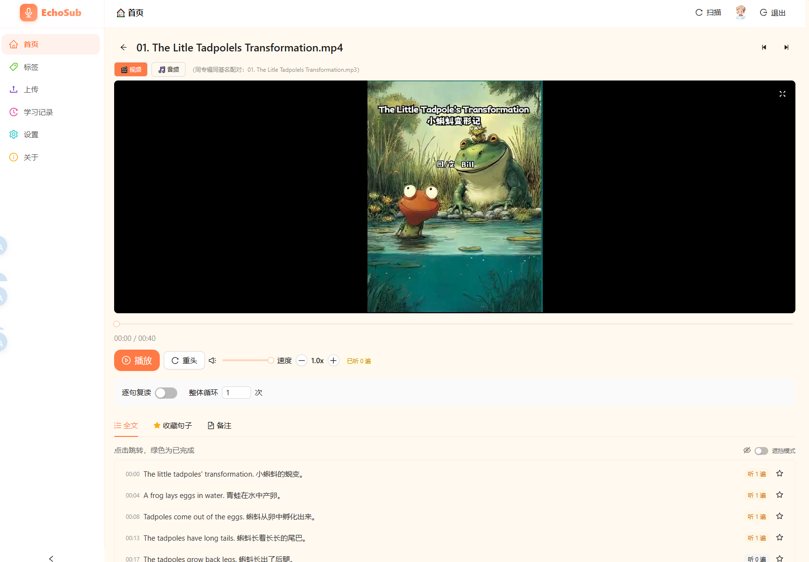

<div align="center">

# 🎬🎧 EchoSub

### 自托管的 Emby 风格语言学习与文本背诵 Web 应用

**逐句复读播放器 · Markdown 学习页 · 季 / 专辑 / 媒体多态标签 · TTS 朗读 · 文件监控**

[English](README.md) | [简体中文](README.md) | [功能需求](docs/需求文档.md) | [更新日志](docs/ChangeLog.md) | [AI 协作指南](CLAUDE.md)

<p>
  <a href="https://github.com/tabortao/EchoSub/releases"></a>
  <a href="LICENSE"></a>
  
  <a href="docs/ChangeLog.md"></a>
  
  
  
  
  
</p>

</div>

---

## 📸 应用预览

<p align="center">
  
  <br/>
  <em>🏠 首页：Emby 风格横向滚动 · 继续观看 · 专辑 / 季 / 学习页入口</em>
</p>

<p align="center">
  
  <br/>
  <em>🎬 逐句复读播放器 · Markdown 学习页 · 多态标签管理</em>
</p>

---

## 📑 目录

- [📸 应用预览](#-应用预览)
- [✨ 概述](#-概述)
- [🚀 功能特性](#-功能特性)
- [🧰 技术栈](#-技术栈)
- [📁 目录结构](#-目录结构)
- [✅ 前置要求](#-前置要求)
- [🏃 快速开始（开发模式）](#-快速开始开发模式)
- [⚙️ 配置说明](#-配置说明)
- [🧪 测试方法](#-测试方法)
- [🏗️ 生产构建](#-生产构建)
- [📚 API 概览](#-api-概览)
- [📊 学习记录页面](#-学习记录页面)
- [🏷️ 标签管理（v0.5.0 多态）](#-标签管理v050-多态)
- [🐳 Docker / NAS 部署](#-docker--nas-部署)
- [🗂️ 版本管理](#-版本管理)
- [📄 许可证](#-许可证)

---

## ✨ 概述

EchoSub 是一款**自托管的 Web 应用**，专为语言学习与文本背诵场景设计。只需将视频 / 音频 + 字幕文件放入被监听的文件夹（NAS / 本地均可），EchoSub 会自动发现、Emby 风格解析元数据并按专辑 / 季分组，提供：

- 🎬 **逐句复读播放器**：每句重复 M 次 → 暂停 K 秒 → 下一句；整体循环 N 次；速度 0.1 步进调节。
- ✍️ **字幕逐句编辑 + AI 双语翻译**（v0.8.0 起）：播放器内可在线编辑每条字幕并通过 OpenAI 兼容接口批量翻译，v0.8.1 默认生成「原文 + 译文」双语字幕（中文 → 中英 / 英文 → 中英）。
- � **AI 字典 + 句子解释**（v0.9.0 起）：设置中可配置词典源；点击每条字幕进入「句子详情页」查看整句翻译 / 逐词拆解 / 语法解析；逐词点击触发 AI 查词弹窗（音标 / 词义 / 词族 / 词源 / 学习提示）。
- �📚 **Markdown 学习页**：每个专辑可创建多份学习笔记，支持多图上传 + 全屏查看 + TTS 朗读。
- 🏷️ **多态标签系统**（v0.5.0 起）：专辑 / 季 / 学习页 / 媒体四类实体可统一打标签与按标签筛选。
- 🎨 **Emby 风格扫描**：自动识别 `folder.jpg` / `banner.jpg` / `tvshow.nfo` 等元数据。
- 🔒 **未读蒙版 + 继续观看**：未学习资源显示灰蒙版 + 🔒 提示；首页自动列出未学完的媒体。

设计理念：

- 学习素材应**零成本整理**：放入文件夹即被识别，无需手动建库。
- 学习过程应**可量化、可回顾**：每句完成、每集进度、每周统计。
- 隐私应**留在本地**：自托管、单二进制、SQLite，无需云端依赖。

## 🚀 功能特性

### 🎬 媒体与播放

- **自动扫描与监听**：启动时全量扫描 + `fsnotify` 实时监听器进行增量更新。
- **Emby 风格专辑扫描**：自动识别 `folder.jpg` / `poster.jpg`（封面）、`banner.jpg` / `backdrop.jpg`（横幅）、`tvshow.nfo` / `album.nfo`（描述）、`season.nfo`（季描述）等元数据。
- **季（Sub-Album）支持**：媒体子目录自动作为季，独立封面 / 横幅 / 描述；季可继承专辑横幅。
- **配对媒体**：同目录同名（仅扩展名不同）的 video + audio 自动配对，列表只显示 video，播放器可一键切换 🎬 视频 / 🎵 音频。
- **字幕解析**：支持 SRT / WebVTT，统一为 `Sentence{Index, Start, End, Text}` 结构。处理 UTF-8 BOM、CRLF、`HH:MM:SS,mmm` / `MM:SS,mmm` / `SS,mmm` 时间戳格式。
- **字幕逐句编辑**（v0.8.0 起）：播放器内可在线修改每条字幕的时间戳与文本，保存后原子写回 SRT / VTT 文件（先写 `.tmp` 再 `rename`）。
- **AI 双语字幕**（v0.8.1 起）：通过 OpenAI 兼容代理接口批量翻译字幕，默认生成「原文 + 译文」双语字幕（中文 → 中英 / 英文 → 中英），可在播放器内一键应用。
- **逐句复读播放器**：每句重复 M 次 → 暂停 K 秒 → 下一句；整体循环 N 次；速度 0.1 步进，范围 0.5~2.0。
- **逐句进度跟踪**：标记句子完成状态、跟踪重复次数、收藏；按专辑 / 标签聚合统计。
- **继续观看**：首页「继续观看」区显示未学完的媒体，自动从上次位置续播。
- **未读蒙版**：未学习的媒体 / 季显示半透明灰色蒙版 + 🔒 图标 + 「未开始」提示，开始学习后自动解锁。
- **流式播放**：媒体文件支持 HTTP Range 请求；HTML5 元素通过 `?token=` 查询参数传递 JWT。

### 📚 学习与笔记

- **学习页面（Study Notes）**：每个专辑可创建多个 Markdown 学习页，支持多图上传 + 全屏查看 + TTS 朗读。
- **媒体备注（Remark）**：每个媒体文件可附一段 Markdown 备注，默认预览模式，一键切换编辑。
- **TTS 朗读**：基于 VoiceCraft API (`https://tts.wangwangit.com`)，可配置默认语音与速度（0.5~2.0）。
- **学习统计**：周 / 月 / 年三视图，柱状图展示播放次数、媒体数、句子数；按专辑的「已学/总数」进度条。

### 🏷️ 标签管理（v0.5.0 多态）

- **多态标签**：单个标签可同时附加到「专辑 / 季 / 学习页 / 媒体文件」四种实体类型。
- **覆盖式保存**：通过通用 `TagManagerModal` 一次性设置某实体的全部标签。
- **按标签筛选**：标签页面选中标签后，按 专辑 / 季 / 文件（媒体 + 学习页）三组展示。
- **向后兼容**：历史媒体标签（v0.3.x 的 GORM many2many `media_tags` 表）与新 `entity_tags` 表合并去重。

### 🗂️ 专辑 / 季 编辑

- **置顶专辑**：`📌 置顶专辑` 后，专辑优先在首页与专辑页最前展示。
- **重命名专辑 / 季**：通过 ⋮ 菜单在线修改磁盘目录名（自动同步扫描器）。
- **上传封面 / 横幅图片**：将本地图片作为 `folder.jpg` / `banner.jpg` 写入专辑或季目录。
- **删除（密码确认）**：删除专辑、季、媒体、学习页面、文件时需输入登录密码二次确认。

### 🔐 账户与认证

- **JWT 认证**：bcrypt 密码哈希，使用 `golang-jwt/jwt/v5`，默认有效期 72 小时。
- **用户名规则**：`^[a-zA-Z0-9_]{3,64}$`；密码规则：8~64 字符，必须包含字母 + 数字。
- **用户资料**：修改密码、修改用户名、上传头像。

### 🐳 部署

- **单二进制部署**：后端直接托管已构建的 SPA，单端口运行（默认 `8080`）。
- **Docker 多阶段构建**：`golang:1.26-alpine` → `node:22-alpine` → `alpine:3.20`（含 ffmpeg）。
- **GitHub Actions**：tag `v*` 推送时构建 `linux/amd64` + `linux/arm64` 多架构镜像并推送至 `ghcr.io/yaole/echosub:latest`。

## 🧰 技术栈

| 层级     | 技术栈 |
|----------|-------|
| 后端     | [Go](https://go.dev/) 1.26 · [Gin](https://gin-gonic.com/) · [GORM](https://gorm.io/) · SQLite ([glebarez/sqlite](https://github.com/glebarez/sqlite), CGO-free) · [JWT](https://github.com/golang-jwt/jwt) · [fsnotify](https://github.com/fsnotify/fsnotify) |
| 前端     | [React](https://react.dev/) 19 · [TypeScript](https://www.typescriptlang.org/) 6 · [Vite](https://vite.dev/) 8 · [Ant Design](https://ant.design/) 6 · [zustand](https://zustand-demo.pmnd.rs/) · [axios](https://axios-http.com/) · [react-router-dom](https://reactrouter.com/) 7 · [react-markdown](https://github.com/remarkjs/react-markdown) |
| 基础设施 | Docker 多阶段构建 · [docker-compose](https://docs.docker.com/compose/) · GitHub Actions (GHCR 多架构) |

## 📁 目录结构

```
EchoSub/
├── backend/                          # Go 后端
│   ├── cmd/server/                   # 入口程序 (main.go)
│   ├── internal/
│   │   ├── config/                   # 配置加载器 (env > yaml > 默认值)
│   │   ├── database/                 # GORM + SQLite 初始化
│   │   ├── handlers/                 # HTTP 处理器
│   │   │   ├── auth.go               # 注册/登录/资料
│   │   │   ├── media.go              # 媒体/专辑/季/流式/封面/字幕
│   │   │   ├── tag.go                # 媒体标签 CRUD
│   │   │   ├── entity_tag.go         # 多态标签 attach/detach/筛选（v0.5.0）
│   │   │   ├── note.go               # 学习页 CRUD + 图片（v0.4.2+）
│   │   │   ├── remark.go             # 媒体备注（v0.4.2+）
│   │   │   ├── record.go             # 播放记录 + 进度统计 + 继续观看
│   │   │   ├── scan.go               # 扫描触发 + 状态
│   │   │   ├── settings.go           # 用户设置
│   │   │   ├── album_meta.go         # Emby 元数据 (folder/banner/nfo)
│   │   │   ├── album_pin.go          # 专辑置顶
│   │   │   ├── filemanager.go        # 文件浏览/上传
│   │   │   └── delete.go             # 文件/专辑/季 删除（密码确认）
│   │   ├── middleware/               # JWT 认证（含 ?token= 兜底）+ CORS
│   │   ├── models/                   # GORM 数据模型（含 EntityTag）
│   │   ├── router/                   # 路由注册
│   │   ├── scanner/                  # 媒体扫描器 + fsnotify 监听器 + Emby 元数据
│   │   └── utils/                    # 响应辅助工具
│   ├── pkg/subtitle/                 # SRT/VTT 解析器 (含 8 个单元测试)
│   ├── config.example.yaml
│   └── go.mod
├── frontend/                         # React 单页应用
│   ├── src/
│   │   ├── api/                      # axios 客户端 + API 模块
│   │   ├── components/
│   │   │   ├── MediaPlayer.tsx       # 核心播放器（含 video/audio 切换 tab）
│   │   │   ├── MediaCover.tsx        # 封面组件
│   │   │   ├── EmbyHome.tsx          # 首页 Emby 风格横向滚动布局
│   │   │   ├── NoteCardMenu.tsx      # 学习页 ⋮ 菜单（v0.4.5+）
│   │   │   ├── SeasonCardMenu.tsx    # 季 ⋮ 菜单
│   │   │   ├── TagManagerModal.tsx   # 通用标签管理弹窗（v0.5.0）
│   │   │   ├── PasswordConfirmModal.tsx
│   │   │   └── ...
│   │   ├── layouts/                  # MainLayout 主布局（侧边栏）
│   │   ├── pages/
│   │   │   ├── Home.tsx              # 首页（Emby 风格 / 网格视图）
│   │   │   ├── Albums.tsx            # 专辑列表
│   │   │   ├── Tags.tsx              # 标签管理 + 筛选（v0.5.0）
│   │   │   ├── Records.tsx           # 学习记录 + 周/月/年统计
│   │   │   ├── Settings.tsx          # 设置（含 TTS 配置）
│   │   │   ├── Player.tsx            # 媒体播放器
│   │   │   ├── NoteEditor.tsx        # 学习页编辑器
│   │   │   ├── Upload.tsx            # 文件上传
│   │   │   ├── About.tsx             # 关于
│   │   │   └── Login.tsx             # 登录 / 注册
│   │   ├── router/                   # ProtectedRoute 路由守卫
│   │   ├── store/                    # zustand: auth + settings + scan
│   │   ├── types/                    # TS 类型定义
│   │   └── utils/                    # 格式化辅助工具
│   └── vite.config.ts                # @ 别名 + /api 代理 → :8080
├── scripts/
│   ├── test-api.ps1                  # API 端到端集成测试（11 项）
│   └── verify-emby.ps1               # Emby 扫描验证
├── test-media/                       # 本地测试用示例媒体
├── docs/                             # 需求文档 + 更新日志 + 计划
├── Dockerfile                        # 3 阶段构建
├── docker-compose.yml                # NAS 部署配置
├── CLAUDE.md                         # AI 协作指南
└── .github/workflows/                # CI 持续集成
```

## ✅ 前置要求

- **[Go](https://go.dev/)** ≥ 1.26（无需 CGO）
- **[Node.js](https://nodejs.org/)** ≥ 20 + **[pnpm](https://pnpm.io/)**（或 npm/yarn）
- **PowerShell** 或任意 Shell
- *（可选）* **[Docker](https://www.docker.com/)** 用于容器化部署

> 🇨🇳 中国大陆网络环境：设置 `GOPROXY=https://goproxy.cn,direct` 可加速 Go 模块下载。
> ⚠️ Windows PowerShell 5.1 不支持 UTF-8 CJK 编码，所有脚本均保持纯 ASCII。

## 🏃 快速开始（开发模式）

### 1️⃣ 后端

```powershell
cd backend
copy config.example.yaml config.yaml   # 然后按需修改 media.dir
go mod download
go run ./cmd/server
```

服务器监听 `http://localhost:8080`。

通过环境变量覆盖任意配置（前缀 `ECHOSUB_`）：

```powershell
$env:ECHOSUB_MEDIA_DIR = "D:\Code\Go\EchoSub\test-media"
$env:ECHOSUB_JWT_SECRET = "dev-secret"
go run ./cmd/server
# 关闭已运行的实例
Get-NetTCPConnection -LocalPort 8080 | ForEach-Object { Stop-Process -Id $_.OwningProcess -Force }
```

### 2️⃣ 前端（带 HMR 热更新的开发服务器）

```powershell
cd frontend
pnpm install
pnpm dev
```

Vite 开发服务器运行在 `http://localhost:5173`，并将 `/api` 代理到 `http://localhost:8080`。

打开 `http://localhost:5173`，注册新账号即可开始使用。

## ⚙️ 配置说明

| 环境变量               | yaml 路径             | 默认值                       | 描述                       |
|------------------------|------------------------|------------------------------|----------------------------|
| `ECHOSUB_PORT`         | `server.port`          | `8080`                       | HTTP 端口                  |
| `ECHOSUB_DB_PATH`      | `database.path`        | `data/echosub.db`            | SQLite 文件路径            |
| `ECHOSUB_JWT_SECRET`   | `jwt.secret`           | `change-me-in-production`    | JWT 签名密钥               |
| `ECHOSUB_MEDIA_DIR`    | `media.dir`            | `/media`                     | 媒体根目录                 |

支持的文件扩展名：视频 `.mp4/.mkv/.mov/.webm/.avi`，音频 `.mp3/.m4a/.aac/.wav/.flac/.ogg`，字幕 `.srt/.vtt`。
图片（封面 / 横幅 / 学习页）：`.jpg/.jpeg/.png/.webp`。

## 🧪 测试方法

### 单元测试（Go）

```powershell
cd backend
go test ./... -v
```

覆盖字幕解析器（SRT 基础/CRLF/BOM/空文件、VTT 基础/短格式、时间戳解析、时长格式化）。

### API 集成测试（端到端）

一个自包含的 PowerShell 脚本，会启动后端（使用内存测试数据库）并完整走通 认证 → 扫描 → 媒体 → 字幕 → 记录 → 进度 流程。

```powershell
# 在仓库根目录执行
.\scripts\test-api.ps1
```

也可以手动逐步执行 —— 详见 [scripts/test-api.ps1](scripts/test-api.ps1)。

### 前端构建验证

```powershell
cd frontend
pnpm build      # tsc -b && vite build
```

干净的构建可证明整个 SPA 的类型安全性。

## 🏗️ 生产构建

### 单二进制（同一端口同时提供 SPA + API 服务）

```powershell
# 构建前端
cd frontend
pnpm install
pnpm build           # 输出到 frontend/dist

# 构建后端（运行时会自动加载 frontend/dist）
cd ../backend
go build -o echosub.exe ./cmd/server
```

请从**仓库根目录**运行，以便找到 `frontend/dist`：

```powershell
cd ..   # 仓库根目录
$env:ECHOSUB_MEDIA_DIR = "D:\path\to\media"
.\backend\echosub.exe
```

打开 `http://localhost:8080`。

### Docker

```powershell
docker build -t echosub .
docker run -p 8080:8080 `
  -e ECHOSUB_JWT_SECRET=please-change-this-secret `
  -v D:\path\to\media:/media:ro `
  -v echosub-data:/app/data `
  echosub
```

### 通过 docker-compose 部署到 NAS

编辑 `docker-compose.yml`，将 `/path/to/your/media` 指向你的 NAS 共享路径，然后：

```powershell
docker compose up -d
```

GitHub Actions 会在每次打 tag 时构建多架构镜像（`linux/amd64`、`linux/arm64`）并推送到 `ghcr.io/yaole/echosub:latest`。

## 📚 API 概览

所有接口均位于 `/api/v1` 下。公开接口：`POST /auth/register`、`POST /auth/login`、`GET /health`。其他接口需要 `Authorization: Bearer <jwt>` 请求头，媒体流式端点同时支持 `?token=<jwt>` 查询参数（供 HTML5 `<video>` / `<audio>` 元素使用）。

### 🔐 账户

| Method | Path                              | 描述                                  |
|--------|-----------------------------------|--------------------------------------|
| POST   | `/auth/register`                  | 注册，返回 JWT                        |
| POST   | `/auth/login`                     | 登录，返回 JWT                        |
| GET    | `/auth/me`                        | 获取当前用户信息                      |
| PUT    | `/auth/profile`                   | 修改用户名 / 头像                     |
| PUT    | `/auth/password`                  | 修改密码（验证旧密码）                |

### 🎬 媒体

| Method | Path                              | 描述                                  |
|--------|-----------------------------------|--------------------------------------|
| GET    | `/media`                          | 列表（支持 album/sub_album/type/keyword/tag/sort/order 筛选与分页） |
| GET    | `/media/:id`                      | 媒体详情 + 配对媒体 + 播放记录        |
| GET    | `/media/:id/stream`               | 流式播放（支持 HTTP Range）           |
| GET    | `/media/:id/cover`                | 封面图片                              |
| GET    | `/media/:id/subtitle`             | 已解析句子 + 进度                     |
| PUT    | `/media/:id/subtitle`             | 字幕逐句编辑（v0.8.0）：原子写回 SRT/VTT 文件 |
| GET    | `/media/:id/remark`               | 获取媒体备注 Markdown                 |
| PUT    | `/media/:id/remark`               | 保存 / 覆盖媒体备注                   |
| DELETE | `/media/:id/remark`               | 删除媒体备注                          |
| PUT    | `/media/:id/rename`               | 重命名媒体文件                        |
| DELETE | `/media/:id`                      | 删除媒体（需 `X-Delete-Password`）    |

### 🗂️ 专辑 / 季

| Method | Path                              | 描述                                  |
|--------|-----------------------------------|--------------------------------------|
| GET    | `/albums`                         | 专辑列表（含季、封面、横幅、置顶、标签） |
| GET    | `/albums/:name/cover`             | 专辑 / 季封面（支持 `?sub=Season1`）  |
| POST   | `/albums/:name/cover`             | 上传专辑 / 季封面（multipart）        |
| POST   | `/albums/:name/rename`            | 重命名专辑                            |
| DELETE | `/albums/:name`                   | 删除专辑（需 `X-Delete-Password`）    |
| POST   | `/albums/:name/pin`               | 切换专辑置顶状态                      |
| DELETE | `/albums/:name/sub/:sub`          | 删除季（需 `X-Delete-Password`）      |

### 📝 学习页（Notes）

| Method | Path                              | 描述                                  |
|--------|-----------------------------------|--------------------------------------|
| GET    | `/notes?album=xxx`                | 列出某专辑下的学习页                  |
| POST   | `/notes`                          | 新建学习页                            |
| GET    | `/notes/:id`                      | 获取学习页                            |
| PUT    | `/notes/:id`                      | 更新学习页（标题/内容/置顶）          |
| POST   | `/notes/:id/pin`                  | 切换学习页置顶                        |
| DELETE | `/notes/:id`                      | 删除学习页（需 `X-Delete-Password`）  |
| POST   | `/notes/:id/images`               | 上传学习页图片（multipart）           |
| DELETE | `/notes/:id/images/:filename`     | 删除单张学习页图片                    |
| GET    | `/notes/:id/images/:filename`     | 访问学习页图片（支持 `?token=`）      |

### 🏷️ 标签

| Method | Path                              | 描述                                  |
|--------|-----------------------------------|--------------------------------------|
| GET    | `/tags`                           | 列出当前用户全部标签                  |
| POST   | `/tags`                           | 创建标签                              |
| PUT    | `/tags/:id`                       | 更新标签                              |
| DELETE | `/tags/:id`                       | 删除标签                              |
| POST   | `/media/:id/tags`                 | 媒体分配标签（覆盖式，向后兼容）      |
| POST   | `/tags/:id/attach`                | 多态标签 attach                       |
| POST   | `/tags/:id/detach`                | 多态标签 detach                       |
| PUT    | `/tags/entity?type=&id=`          | 覆盖式设置某实体的全部标签            |
| GET    | `/tags/entity?type=&id=`          | 获取某实体的全部标签                  |
| GET    | `/tags/:id/entities`              | 按标签列出实体（分专辑/季/文件）      |

### 📊 播放记录 / 进度

| Method | Path                              | 描述                                  |
|--------|-----------------------------------|--------------------------------------|
| PUT    | `/records/:mediaId`               | 新增或更新播放记录                    |
| GET    | `/records`                        | 播放记录列表                          |
| GET    | `/records/:mediaId`               | 获取单条播放记录                      |
| GET    | `/records/recent?unfinished=true` | 继续观看列表（last_position>0 且 <95% duration）|
| PUT    | `/records/:mediaId/sentences/:idx`| 新增或更新句子进度（完成/重复次数/收藏）|
| GET    | `/progress`                       | 聚合进度（按专辑/标签）               |
| GET    | `/records/stats?granularity=...`   | 周/月/年统计                          |

### ⚙️ 文件 / 扫描 / 设置

| Method | Path                              | 描述                                  |
|--------|-----------------------------------|--------------------------------------|
| GET    | `/fs/browse?path=xxx`             | 浏览媒体目录（用于上传界面）          |
| POST   | `/fs/upload`                      | 文件上传（multipart）                 |
| DELETE | `/fs/delete?path=xxx`             | 删除文件 / 文件夹（需 `X-Delete-Password`）|
| POST   | `/scan/trigger`                   | 触发全量重新扫描                      |
| GET    | `/scan/status`                    | 扫描器状态                            |
| GET    | `/settings`                       | 获取用户设置                          |
| PUT    | `/settings`                       | 更新用户设置（loop/sentence/pause/TTS）|

### 🤖 AI 翻译（v0.8.0，OpenAI 兼容代理）

| Method | Path                              | 描述                                  |
|--------|-----------------------------------|--------------------------------------|
| GET    | `/ai/status`                      | AI 配置状态（enabled / model / target_lang，**不返回** API key） |
| POST   | `/ai/translate`                   | 批量翻译字幕（最多 200 条/次，转发到 OpenAI 兼容 `chat/completions`；v0.8.1 起支持 `mode=bilingual\|replace`，默认 `bilingual` 生成双语字幕）|
| POST   | `/ai/test`                        | 连通性测试（v0.8.1 起；用 `texts=["Hello"]` 调一次 AI，返回 `{ok, enabled, model, base_url_host, sample_translation, latency_ms, message}`，便于在设置页一键验证）|
| POST   | `/ai/dictionary`                  | 字典查词（v0.9.0 起；请求体 `{word, sentence?, target_lang?}`，AI 返回结构化词条 `headword / pronunciation(uk,us) / meanings[] / word_family[] / etymology / learner_tips[]`，可选 `sentence` 用于上下文消歧）|
| POST   | `/ai/sentence-explain`            | 句子解释（v0.9.0 起；请求体 `{sentence, target_lang?, source_lang?, features?}`，AI 返回 `original / translation / words[] / grammar / notes`；`features.word/grammar/translation` 可按需关闭，缺省三个全开）|

> 配置：通过 `ECHOSUB_AI_BASE_URL` / `ECHOSUB_AI_API_KEY` / `ECHOSUB_AI_MODEL` 等环境变量注入后端，密钥不出前端、不进数据库。设置页「🤖 AI 翻译」卡片提供「⚡ 测试连通性」按钮，命中后即在卡片内显示绿色「连通正常」+ 耗时 +「Hello → 你好」样例。详见 [ChangeLog v0.8.0](docs/ChangeLog.md#v080---2026-07-06) 与 [ChangeLog v0.8.1](docs/ChangeLog.md#v081---2026-07-06)。
>
> 字典与句子解释共用同一 AI 配置；词典体系采用可插拔数据源设计（`id='ai'` 已实装，`id='local'` 预留扩展点），具体见 [ChangeLog v0.9.0](docs/ChangeLog.md#v090---2026-07-06)。在播放器中点击字幕右侧「📖」按钮可进入「句子详情页」（路径 `/play/:id/sentence/:idx`），从单词卡片二次点击触发 AI 查词弹窗。

## 默认测试账号

集成测试会注册 `testuser` / `test123456`。在你自己的运行环境中，可通过 UI 或 `POST /api/v1/auth/register` 注册任意账号。

## 📊 学习记录页面（Study Records）

→「学习记录」页面（路由 `/records`）提供学习数据的统计与回溯能力，与项目「语言学习 + 文本背诵」的特性一致，包含以下模块：

### 顶部汇总卡片

- **已背诵句子数**（绿色）：来自 `SentenceProgress.completed` 的全局聚合
- **播放记录数**（橙色）：当前用户的 `PlayRecord` 总数
- **专辑数**（黄色）：有播放记录的专辑数量

### 周 / 月 / 年统计（Tabs 切换）

数据来自后端 `GET /records/stats?granularity=week|month|year&date=YYYY-MM-DD`，统计源为 `PlayRecord.last_played_at` 与 `SentenceProgress.updated_at`。

- **📅 本周视图**（紧凑单行布局）
  - 周一 ~ 周日 **单行 7 列**显示，每列上方为「星期 + 日期号」，下方依次为当日柱状图与「播放次数 / 媒体数 / 背诵句子数」
  - 当日列以橙色边框 + 浅橙背景高亮
  - 顶部汇总一行展示：总播放次数 / 学习媒体数 / 背诵句子数
  - 支持左右翻页（±7 天），「回到本周」按钮一键回到当前周
- **🗓️ 本月视图**：12 个月统计卡片网格，按年翻页
- **📆 年度视图**：最近 5 年统计卡片网格，按 5 年翻页

### 按专辑进度

列出每个专辑的「已学/总数」媒体数与「共听 N 次」，配橙色进度条。

### 播放记录表

按时间倒序列出所有播放记录（媒体名、专辑、播放次数、上次进度、上次播放时间），点击媒体名可跳转播放页。

## 🏷️ 标签管理（v0.5.0 多态）

→「标签」页面（路由 `/tags`）提供标签 CRUD + 按标签筛选能力：

- **顶部**：标签输入框 + 「添加」按钮，实时创建标签。
- **中部**：标签卡片网格，每张卡片显示：
  - 标签名
  - 「📂 专辑 N」「📁 季 N」「📄 文件 N」三类实体的数量徽标
  - 右侧 ✏️ / 🗑️ 操作按钮
- **点击卡片**：下方展开三组结果，分别以卡片列表展示
  - 专辑组：📂 专辑（点击进入专辑页）
  - 季组：📁 季（点击进入该季详情）
  - 文件组：合并展示 🎬 视频 / 🎵 音频 + 📝 学习页，点击分别进入播放器 / 笔记编辑器

每张专辑 / 季 / 学习页 / 媒体文件卡片 / 行内都有 🏷️ 管理标签 入口（专辑标题区按钮、季 ⋮ 菜单、媒体 ⋮ 菜单、学习页 ⋮ 菜单 + 编辑器顶部按钮），统一通过 `TagManagerModal` 完成多选打标签。

## 🐳 Docker / NAS 部署说明

### 镜像构建

- `Dockerfile` 使用 3 阶段构建：`golang:1.26-alpine`（后端）→ `node:22-alpine`（前端）→ `alpine:3.20`（运行时，含 ffmpeg）。
- GitHub Actions（`.github/workflows/docker.yml`）在 push tag `v*` 时构建 `linux/amd64` + `linux/arm64` 多架构镜像并推送至 `ghcr.io/tabortao/echosub:latest`；push `main` 分支构建 `dev` tag。
- **后端配置文件无需修改**：容器内媒体目录固定为 `/media`（由 `ECHOSUB_MEDIA_DIR=/media` 指定），只需在 `docker-compose.yml` 的 `volumes` 中把宿主机的 NAS 路径挂载到 `/media` 即可。

### 📂 NAS 媒体目录映射（docker-compose.yml）

仓库根目录的 `docker-compose.yml` 已配置好相对路径卷挂载，**开箱即用**：

```yaml
services:
  echosub:
    image: ghcr.io/tabortao/echosub:latest
    container_name: echosub
    restart: unless-stopped
    ports:
      - "8080:8080"
    environment:
      - ECHOSUB_PORT=8080
      - ECHOSUB_DB_PATH=/app/data/echosub.db
      - ECHOSUB_MEDIA_DIR=/media
      - ECHOSUB_JWT_SECRET=please-change-this-secret  # ★ 修改为随机字符串 ★
      - GIN_MODE=release
    volumes:
      # 媒体目录：将宿主机的 NAS 媒体文件夹挂载到容器的 /media
      # 默认映射到 ./Media（仓库同级目录），如需指向 NAS 路径请按下方示例修改
      - ./media:/media
      # 数据持久化：SQLite 数据库 + 笔记图片（建议保留在宿主机本地，不要放 NAS）
      - ./data:/app/data
```

启动步骤：

```powershell
# 1. 在仓库根目录创建本地挂载点（首次部署时）
mkdir Media Data

# 2. （可选）把 NAS 媒体内容链接或拷贝到 ./Media
#    Linux/macOS:  ln -s /volume1/media/EchoSub ./Media
#    Windows:     New-Item -ItemType Junction -Path .\Media -Target \\NAS\media\EchoSub

# 3. 修改 ECHOSUB_JWT_SECRET 为随机字符串

# 4. 启动
docker compose up -d
```

### 🔀 NAS 路径映射示例（按需修改 volumes 块）

不同 NAS / 宿主机的挂载方式不同，**只需替换下面 yaml 中 `- ./Media:/media` 这一行的左侧路径**：

```yaml
volumes:
  # Synology / 群晖 DSM（NFS/SMB 已挂载到宿主机）
  - /volume1/media/EchoSub:/media

  # 通用 Linux 宿主机 NFS 挂载点
  - /mnt/nas/EchoSub:/media

  # Windows Docker Desktop + SMB 直连（需先 docker login 配置）
  # 注意 Docker Desktop 需启用 "Use the WSL 2 based engine"
  - //192.168.1.10/media/EchoSub:/media

  # Windows 已映射为 Z 盘
  - Z:/EchoSub:/media
```

> ⚠️ **挂载模式说明**
> - 媒体目录默认**读写**挂载（上传 / 专辑重命名 / 封面写入功能需要写入权限）。
> - 如仅做播放不上传，可在挂载路径末尾追加 `:ro`，例如 `./Media:/media:ro`。
> - 数据库（`/app/data`）建议保留在宿主机本地卷，不要放 NAS，避免 SQLite WAL 在网络文件系统上出现锁问题。

## 🗂️ 版本管理

- 每个自然日的所有变更合并为 **一个** 版本号（如 `v0.7.0`），详见 [docs/ChangeLog.md](docs/ChangeLog.md)。
- 版本遵循 [Keep a Changelog 1.0.0](https://keepachangelog.com/en/1.0.0/) 规范，仅使用 `Added` / `Changed` / `Deprecated` / `Removed` / `Fixed` / `Security` 六类。
- 当前活跃版本：**v0.7.0**（动物森友会风格全站 UI 重设计）。

## 🏝️ 动森风格设计语言（v0.7.0）

参考 `docs/Reference/animal-island-ui` 设计稿，本项目采用动物森友会（Animal Crossing）风格设计语言，营造温暖、童趣、亲和的视觉氛围。

### 设计 Token 速查

| Token | 值 | 用途 |
|------|------|------|
| `--ac-bg-page` | `#f8f8f0` 暖羊皮 | 页面底色 |
| `--ac-bg-content` | `rgb(247, 243, 223)` 羊皮纸 | 卡片 / Modal / Table 内容区 |
| `--ac-primary` | `#19c8b9` 薄荷绿 | 主色（Nook Inc. 招牌色） |
| `--ac-text-header` | `#794f27` 深咖 | 标题文字 |
| `--ac-text-secondary` | `#9f927d` 米灰 | 副标题 / 描述文字 |
| `--radius-pill` | `50px` | 按钮 / 输入框 |
| `--radius-lg` | `20px` | 卡片 |
| `--radius-md` | `12px` | chip / 小标签 |
| 3D 按钮阴影 | `0 5px 0 0 var(--ac-shadow-button)` | 主按钮按下感 |
| 卡片阴影 | `0 8px 24px rgba(25, 200, 185, 0.12)` | 卡片浮起 |
| 主字体 | Nunito + Noto Sans SC | 全局字体 |

### 13 色 NookPhone 调色板

通过 `radial-gradient` 双层叠加生成 polka-dot 点阵背景色块，无需任何外部图片资源：

| 颜色 | 色值 | 配色类 |
|------|------|------|
| 樱花粉 | `#f8a6b2` | `.ac-pattern-pink` |
| 紫丁香 | `#b77dee` | `.ac-pattern-purple` |
| 天空蓝 | `#889df0` | `.ac-pattern-blue` |
| 草绿 | `#6fba2c` | `.ac-pattern-green` |
| 柠檬黄 | `#ffe066` | `.ac-pattern-yellow` |
| 暖阳橙 | `#ff9f5a` | `.ac-pattern-orange` |
| 番茄红 | `#ff7575` | `.ac-pattern-red` |
| 薄荷青 | `#5ed3c7` | `.ac-pattern-cyan` |
| 树皮棕 | `#b5926b` | `.ac-pattern-brown` |
| 沙米色 | `#e6d4a3` | `.ac-pattern-beige` |
| 嫩薄荷 | `#a8e6cf` | `.ac-pattern-mint` |
| 薰衣草 | `#c8a8e9` | `.ac-pattern-lavender` |
| 蜜桃 | `#ffb5a7` | `.ac-pattern-peach` |

### 紧凑卡片布局规则（移动端/平板端）

| 断点 | 视口宽度 | 媒体卡宽度 | 专辑卡宽度 | 横向滚动 gap |
|------|---------|-----------|-----------|------------|
| 手机 | `< 768px` | 130-150px | 130-150px | 12px |
| 平板 | `768-1280px` | 160px | 160px | 12px |
| 桌面 | `≥ 1280px` | 180px+ | 180px+ | 12px |

- 专辑封面统一 `aspect-ratio: 2/3` + `border-radius: var(--radius-lg)`（20px）
- 卡片标题统一 14px / 700 字重 / `var(--ac-text-header)` 颜色
- 缩略图尺寸 96-160px，自适应视口
- 横向滚动行 `padding: 8` + `gap: 12`，右部渐变遮罩提示可左滑

### 4 套主题主色（动森风调整）

| 主题 | 主色 | 风格 |
|------|------|------|
| 暖阳橙 | `#FF9F5A` | 温暖活泼（推荐） |
| 草绿 | `#6fba2c` | 自然清新 |
| 紫丁香 | `#b77dee` | 梦幻神秘 |
| 天空蓝 | `#889df0` | 宁静治愈 |

每套主题均提供 light / dark 双调色板，与 AC 风 token 协同切换。

### 验证方式

- `go build ./...` / `go vet ./...` / `go test ./... -v`（subtitle 8 用例）全部通过
- `pnpm build` 通过：tsc -b 严格类型检查 + Vite 打包，1513 modules，27 PWA precache
- 浏览器 DevTools 切换 iPhone SE / 14 Pro / iPad mini 验证紧凑卡片布局

> 上一轮 v0.6.0 的设备适配矩阵、深色模式适配、PWA 等基础设施详见 Git 历史。本轮 v0.7.0 在 v0.6.0 基础上叠加动森风格设计语言。

## 📄 许可证

私有项目。详见仓库设置。

---

<div align="center">

用 ❤️ 打造 · 欢迎 Star ⭐️ 与 Issue 反馈

[⬆ 回到顶部](#-echosub)

</div>

